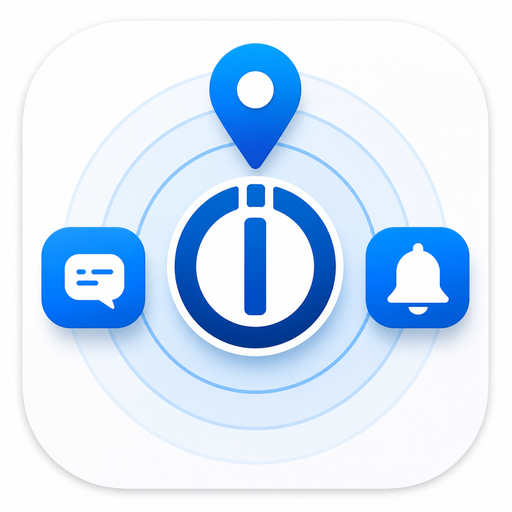

# ioBroker.iobapp

ioBroker.iobapp verbindet iPhone, iPad und Apple Watch mit ioBroker. Der Adapter nimmt Sensordaten, Standort-Updates, Indoor-BLE-Scans, HealthKit-Werte und App-/Watch-Aktionen der iOS-App entgegen und legt sie als ioBroker-Objekte unter `iobapp.<instanz>` ab.

Der aktuelle Fokus liegt auf einer Home-Assistant-ähnlichen iOS-Integration: iOS-Systemtrigger, Silent Push, Geozonen, Sensor-Snapshots und transparente Diagnose statt eines dauerhaft laufenden Hintergrund-WebSockets.

## Funktionen

- iPhone-/iPad-Sensoren: Batterie, Ladezustand, Netzwerkstatus, Gerätestatus, App-Version, letzter Flush und Diagnosewerte
- Standort und Presence: GPS-Position, Geozonen, Zone betreten/verlassen, `last_update_trigger`
- Apple Watch: Watch-Snapshots über das iPhone, Batterie-/Bewegungs-/Health-Kontext soweit durch iOS/watchOS verfügbar
- HealthKit: optionale Health-Daten wie Herzfrequenz, HRV, Blutsauerstoff und weitere freigegebene Werte
- Notifications: ioBroker-Nachrichten an einzelne Geräte, Personen oder globale Ziele; Fallback über Apple Push, wenn die App nicht per WebSocket erreichbar ist
- Silent Push: Wake-Push über externes Relay, wenn ein Gerät zu lange kein `last_seen` gesendet hat
- Indoor-Positionierung: BLE-/iBeacon-Scans, Räume/Areas lernen, Beacons klassifizieren und Area-Kandidaten prüfen
- NFC/App-Actions: optionale Actions für Tags, Widgets und AppIntents über den Action-Katalog

## Architektur

Die iOS-App hält keine dauerhaft garantierte Hintergrundverbindung offen. iOS beendet Apps im Hintergrund bewusst. Deshalb arbeitet die Integration mit Ereignissen, die iOS zuverlässig zulässt:

- App-Start und Foreground
- Significant Location Change
- Geofence Enter/Exit
- Battery-/Motion-/Network-Änderungen, soweit iOS sie liefert
- Watch Context Updates
- BGAppRefresh-Fenster
- Silent Push über APNs als zusätzlicher Wake-Trigger

Der Adapter bleibt rückwärtskompatibel zum bestehenden WebSocket-Protokoll. Neue Funktionen werden über optionale Capabilities aktiviert.

## Installation

### Adapter aus GitHub installieren

In ioBroker Admin:

1. `Adapter` öffnen
2. GitHub-/Custom-Installation wählen
3. Repository eintragen:

```text
https://github.com/DNAngelX/ioBroker.iOSAppAdapter
```

Alternativ auf dem ioBroker-Host:

```bash
iobroker url https://github.com/DNAngelX/ioBroker.iOSAppAdapter --host <host>
```

Danach eine Instanz `iobapp.0` anlegen oder neu starten.

### iOS-App einrichten

1. App `IoBroker Tools` installieren
2. ioBroker-System hinzufügen
3. Host, WebSocket-Port, Benutzer und Passwort eintragen
4. Verbindung testen
5. Sensoren, Standort, HealthKit, Watch und Indoor-Positionierung nach Bedarf aktivieren

## Ports und Erreichbarkeit

### WebSocket-Port

Standard-Port des Adapters:

```text
9192/tcp
```

Dieser Port wird von der iOS-App für die direkte WebSocket-Verbindung zum Adapter genutzt.

Empfehlung:

- im Heimnetz direkt `http://<iobroker-ip>:9192` verwenden
- außerhalb des Heimnetzes bevorzugt VPN, WireGuard, Tailscale oder Reverse Proxy nutzen
- Port `9192` nicht ungeschützt dauerhaft ins Internet öffnen

Wenn ein direkter Zugriff bewusst gewünscht ist, muss im Router eine TCP-Portfreigabe auf den ioBroker-Host eingerichtet werden:

```text
Extern: 9192/tcp -> ioBroker-IP:9192/tcp
```

### MyFRITZ!-DNS Beispiel

Mit MyFRITZ! kann ein stabiler DNS-Name auf den Anschluss zeigen, z. B.:

```text
jan-smarthome.abc123.myfritz.net
```

Beispiel für direkten WebSocket-Zugriff:

```text
jan-smarthome.abc123.myfritz.net:9192
```

Sicherer ist ein Reverse Proxy mit TLS, z. B.:

```text
https://ios.example.myfritz.net
```

Der Proxy sollte dann nur die benötigten ioBroker-iOS-Endpunkte weiterleiten und TLS erzwingen.

### Silent-Push-Relay

Silent Push läuft nicht direkt über ioBroker zum iPhone. Apple verlangt APNs. Deshalb sendet der Adapter bei Bedarf an ein Relay, das APNs mit deinem Apple Developer Key anspricht.

Standard in der Entwicklung:

```text
https://ios.stoll-mueller.de
```

Für einen eigenen Relay-Server muss nach außen normalerweise nur HTTPS freigegeben werden:

```text
443/tcp -> Relay-Server:443/tcp
```

Wenn NGINX oder ein anderer Reverse Proxy davor sitzt, bleibt der Node-/Relay-Port intern und wird nicht direkt veröffentlicht.

## Adapter-Einstellungen

- `Benutzername` / `Passwort`: einfache Adapter-Authentifizierung für die iOS-App
- `WebSocket-Port`: Port für direkte App-Verbindungen, Standard `9192`
- `Silent-Push-Relay aktivieren`: Fallback-Wake über APNs erlauben
- `Relay-URL`: URL des Push-Relays, z. B. `https://ios.stoll-mueller.de`
- `Relay API-Key`: Schlüssel, mit dem der Adapter beim Relay autorisiert wird
- `Wake nach Minuten ohne Last Seen`: ab wann ein Gerät per Silent Push geweckt werden soll
- `Minimaler Abstand zwischen Wake-Pushes`: Schutz gegen Push-Spam
- `Indoor-Positionierung`: BLE-Scans, Lernphase, Mindest-Konfidenz und Presence-Timeout

## ioBroker-Objekte

Typische Struktur:

```text
iobapp.0.person.<Person>.<Device>.sensors.*
iobapp.0.person.<Person>.<Device>.location.*
iobapp.0.person.<Person>.<Device>.diagnostics.*
iobapp.0.person.<Person>.<Device>.indoor.*
iobapp.0.indoor.areas.*
iobapp.0.indoor.beacons.*
iobapp.0.messages.*
```

Wichtige Diagnosewerte:

- `sensors.last_seen`
- `diagnostics.last_flush`
- `diagnostics.last_ack`
- `diagnostics.last_trigger`
- `indoor.last_scan`
- `indoor.beacon_count`
- `indoor.current_area`
- `indoor.confidence`

## Indoor-Positionierung

Indoor-Positionierung basiert auf BLE-/iBeacon-Signalen, nicht auf WLAN-BSSID. iOS gibt BSSID/MAC-Adressen aus Datenschutzgründen nicht zuverlässig frei.

Vorgehen:

1. Indoor in App und Adapter aktivieren
2. Räume/Areas in ioBroker oder in der App auswählen bzw. benennen
3. Lernphase starten und die relevante Area 10-30 Sekunden ablaufen
4. Im Indoor-Dashboard feste Beacons als `fixed`, mobile Geräte als `mobile` und Störquellen als `ignored` klassifizieren
5. Area-Kandidaten in der App prüfen und bei Bedarf pro Area Beacons ein- oder ausschließen

Hinweis: anonyme BLE-Geräte ohne stabilen Namen können ihre iOS-Identifier ändern. Die App filtert generische `Peripheral`-Einträge deshalb aus Indoor-Fingerprints heraus.

## Sicherheit und Datenschutz

- Standort, HealthKit und Indoor-Positionierung sind opt-in.
- HealthKit-Daten werden nur gelesen, wenn der Nutzer sie in iOS freigibt.
- APNs-Schlüssel gehören nicht in Community-ioBroker-Installationen. Für produktive Installationen sollte ein Relay genutzt werden.
- Öffentliche Portfreigaben sollten auf HTTPS/VPN/Reverse Proxy begrenzt werden.

## Entwicklung

```bash
npm install
npm run build
npm test
```

Für lokale Tests kann der Adapter per GitHub-URL oder lokalem Paket in ioBroker installiert werden.

## Changelog

### 0.3.0 (2026-07-19)

- README und Projektbeschreibung für öffentliche Tests überarbeitet
- Adapter-Metadaten auf das aktuelle GitHub-Repository korrigiert
- Indoor-/Silent-Push-/Port-Dokumentation ergänzt

### 0.2.15 (2026-07-13)

- Area-spezifische Include- und Exclude-Modi für Indoor-Beacons ergänzt

### 0.2.14 (2026-07-13)

- Indoor-Kandidaten um Beacon-Match-Details und App-gesteuerte Beacon-Klassifizierung ergänzt

### 0.2.13 (2026-07-13)

- Indoor-Area-Kandidaten zurückgeben und leere manuelle Lernscans akzeptieren

### 0.2.12 (2026-07-13)

- Indoor-Dashboard zeigt nur direkte Area-Kanäle als Areas an

### 0.2.11 (2026-07-13)

- Indoor-Area-Belegung ergänzt und falsche Indoor-Treffer durch Fingerprint-Abdeckungswertung reduziert

### 0.2.10 (2026-07-13)

- Indoor-Dashboard-Listen für Geräte, Areas, Area-Details und Beacons separat scrollbar gemacht

### 0.2.9 (2026-07-13)

- Indoor-Admin-Tab korrekt registriert und ioBroker-Räume über schnellen Enum-View-Fallback geladen

### 0.2.8 (2026-07-13)

- Indoor-Area- und Beacon-Verwaltung mit Fallback auf gelernte Areas für die iOS-App ergänzt

### 0.2.7 (2026-07-13)

- Scrollbarkeit der Settings-Seite und Label-Kontrast im Dark Theme korrigiert

### 0.2.6 (2026-07-13)

- Admin-UI-Start mit dem Materialize-GenericApp-Translation-Set korrigiert

### 0.2.5 (2026-07-13)

- Materialize-Settings-UI korrigiert und ioBroker-Admin-Tab für Indoor-Positionierung ergänzt

### 0.2.4 (2026-07-12)

- Indoor-Positionierung mit BLE-Beacon-Scans, Raum-Lernen und zentralen Area-Fingerprints ergänzt

### 0.2.3 (2026-07-12)

- Nachrichtentypen ergänzt und NFC-Tag-Routing verbessert

### 0.2.2 (2026-07-12)

- Nachrichten-Routing für Personen und globale Nachrichten korrigiert

### 0.2.1 (2024-07-19)

- UI-Fix

### 0.2.0 (2024-07-19)

- Umstellung von REST auf WebSocket
- Verbesserungen im Nachrichten-Cache

### 0.1.0 (2024-07-07)

- Apple Push Service/APNs ergänzt

### 0.0.6 (2024-07-06)

- Integrationsprüfungen ergänzt

### 0.0.5 (2024-07-06)

- WebSocket-Bugfix

### 0.0.3 (2024-07-06)

- Port-Bugfix

### 0.0.2 (2024-07-01)

- Initiale Version

## License

MIT License

Copyright (c) 2024 DNAngelX <stolly82@web.de>
